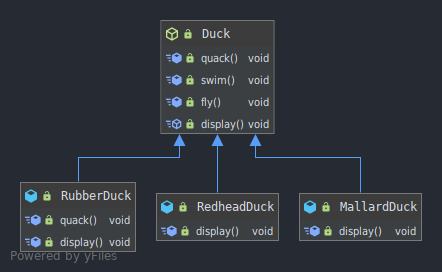

# Strategiemuster
## Ausgangslage
Wir haben beschlossen den Entensimulator zu Entwickeln. Die Anwendung unterstützt mehrere Arten von Enten. Alle Enten können Fliegen, Quacken und Schwimmen.

Jede Ente verfügt über die Methode display. Diese unterscheidet sich für jede Ente.
Es wurde sich entschieden, die Enten mit hilfe von Vererbung zu implementieren.

Jezt wurde die Gummieente integriert. Führt die Testfälle aus. Was fällt auf?

