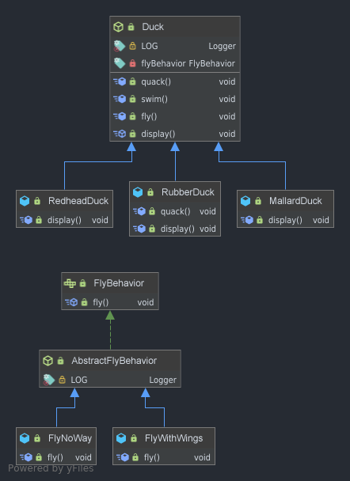

# Strategiemuster
## Lösung

* Trenne die Verhaltensteile von denen die stabil bleiben
* fliegen in eigene Behavior - Klasse auslagern

# Strategiemuster Allgemein

Zweck: Definiere eine Familie von Algorithmen, kapsele jeden einzelnen und mache
sie austauschbar. Das Strategiemuster ermöglicht es, den Algorithmus unabhängig
von den ihn nutzenden Clients zu variieren.