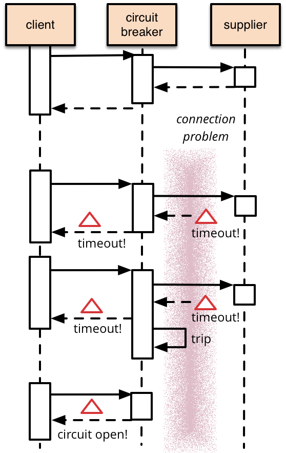

# Circuit Breaker Pattern #
Beischreibung nach Martin Fowler
https://www.martinfowler.com/bliki/CircuitBreaker.html

## Problem ##

* Aufruf von entfernten Systemen (Remote-Calls)
* im Unterschied zu In-Memory-Aufrufen können Remote-Calls fehlschlagen oder
  ohne Antwort hängenbleiben bis ein (möglicherweise langes) Timeout auftritt
* Durch mehrere aufrufe eines fehlerhaften Systems können dadurch wichtige
  Systemresourcen gebunden werden und so zu weiteren Fehlern führen
  
## Lösungsidee ##

* der schützende Remote-Call wird in ein Circuit-Breaker-Objekt verpackt
* dieses überwacht den Call auf Fehler
* Wenn die Anzahl Fehler einen definierten Wert überschreitet wird der
  Ciruit-Breaker ausgelößt (tripping)
* weitere Aufrufe kehren direkt mit einem Fehler zurück ohne den Remote-Call auszuführen

## Übung ##
 * Implementiere eine `CircuitBreakerFactory` die alle Tests erfüllt
 
## Erweiterungen ##

* Reset
* Monitoring
* ...

## Implementierungen und Bibliotheken ##
* Hysterix
* Failsafe (https://github.com/jhalterman/failsafe)
* In Java-EE mittels Interceptor:

    public class SimpleCircuitBreaker {
        private long errorCounter = 0;
        private static final int MAX_FAILURES = 5;
    
        @AroundInvoke
        public Object guard(InvocationContext context) throws Exception {
            try {
                if (errorCounter >= MAX_FAILURES) {
                    return null;
                }
                return context.proceed();
            } catch (Exception ex) {
                ++errorCounter;
                throw ex;
            }
        }
     }